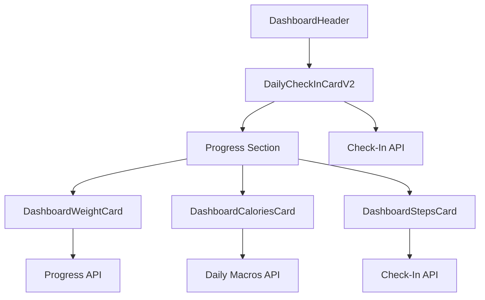

# תוכנית עיצוב מחדש: דשבורד לקוח - Mobile First

## סקירה כללית

עיצוב מחדש מלא של דשבורד הלקוח בהתאם לתמונת ההשראה, עם אופטימיזציה מלאה למובייל. הדשבורד צריך להיראות מודרני, עם אנימציות חלקות וכרטיסים אינטראקטיביים.

## ⚠️ כלל חשוב: NO MOCK DATA

**כל הנתונים חייבים להגיע מה-API בלבד!**

### כללים:
- ❌ **אין mock data** - כל הנתונים מ-API
- ❌ **אין hardcoded values** - כל הערכים דינמיים
- ❌ **אין placeholder data** (חוץ מ-loading states)
- ✅ **כל הנתונים מ-API calls** - Real data only
- ✅ **Error handling** עם empty states
- ✅ **Loading states** עם skeletons

### מה מותר:
- Loading skeletons (רק בזמן טעינה)
- Empty states ("No data to show")
- Error messages (אם API נכשל)

### מה אסור:
- Mock arrays עם נתונים דמה
- Hardcoded numbers (חוץ מ-constants כמו 10000 steps)
- Placeholder data אחרי טעינה

---

## חלק 1: Header Section - עיצוב מחדש

### 1.1 Header Component חדש

**קובץ**: `Frontend/src/components/DashboardHeader.tsx` (חדש)

**עיצוב בהשראת התמונה**:
```
┌─────────────────────────────────────────┐
│ [Profile Pic] Hi there                  │
│            אליאור קרמיזי          [💬] [🔔1] │
└─────────────────────────────────────────┘
```

**רכיבים**:
- **Profile Picture**: 
  - תמונה עגולה או placeholder עם איקון dumbbell
  - גודל: `w-12 h-12` (48x48px)
  - `rounded-full`
  - רקע: `bg-secondary` עם איקון במרכז

- **Greeting Text**:
  - "Hi there" / "שלום" (תלוי בשפה)
  - `text-sm text-muted-foreground`

- **User Name**:
  - שם מלא של המשתמש
  - `text-lg font-semibold text-foreground`
  - Chevron ימינה (לחיצה לפרופיל)

- **Icons** (ימין):
  - **Messages Icon**: `MessageCircle` מ-lucide-react
  - **Notifications Icon**: `Bell` עם badge אדום + מספר
  - גודל: `w-6 h-6`
  - מרווח: `gap-3`

**Layout**:
```tsx
<div className="flex items-center justify-between px-4 py-3 bg-background border-b border-border">
  <div className="flex items-center gap-3">
    <Avatar>...</Avatar>
    <div>
      <p className="text-sm text-muted-foreground">Hi there</p>
      <div className="flex items-center gap-2">
        <span className="text-lg font-semibold">{user.full_name}</span>
        <ChevronRight className="w-4 h-4" />
      </div>
    </div>
  </div>
  <div className="flex items-center gap-3">
    <MessageCircle />
    <Bell with badge />
  </div>
</div>
```

**אנימציות**:
- Fade-in על כניסה
- Hover effects על איקונים
- Ripple effect על לחיצה

---

## חלק 2: Daily Check-In Card - עיצוב מחדש

### 2.1 DailyCheckInCardV2 Component

**קובץ**: `Frontend/src/components/DailyCheckInCardV2.tsx` (חדש)

**עיצוב בהשראת התמונה**:
```
┌─────────────────────────────────────────┐
│ Daily Check-In                    [>]   │
├─────────────────────────────────────────┤
│ [MON 22] [TUE 23] [WED 24] [THU 25]    │
│   [✓]      [✓]      [✓]      [✓]        │
│                                         │
│ 🔥 11 DAY STREAK                        │
│                                         │
│ Check-In                                │
│ [You missed your check-in. Submit now] → │
│                    [Skip this check-in] │
└─────────────────────────────────────────┘
```

**רכיבים**:

1. **Header עם Chevron**:
   - כותרת: "Daily Check-In"
   - Chevron ימינה (לחיצה לפרטים נוספים)
   - `flex items-center justify-between`

2. **Daily Cards Row**:
   - 4-7 כרטיסים קטנים (תלוי בימים בשבוע)
   - כל כרטיס:
     - יום: "MON" / "יום ב'"
     - תאריך: "22"
     - איקון: ✓ (אם הושלם) או ○ (אם לא)
   - **עיצוב**:
     - גודל: `w-14 h-16` (56x64px)
     - רקע: `bg-secondary/50` (לא הושלם) או `bg-primary/20` (הושלם)
     - גבול: `border border-border` או `border-primary` (הושלם)
     - פינות: `rounded-lg`
     - Hover: `hover:scale-105 transition-all`

3. **Streak Indicator**:
   - איקון: 🔥 או `Flame` מ-lucide-react
   - טקסט: "11 DAY STREAK" / "11 יום רצף"
   - `text-orange-400 font-semibold`
   - `flex items-center gap-2`

4. **Check-In Banner**:
   - **אם לא הושלם היום**:
     - רקע: `bg-primary` (כחול/כתום)
     - טקסט: "You missed your check-in. Submit now." / "פספסת את הבדיקה. שלח עכשיו."
     - Chevron ימינה
     - לחיצה: פותח את DailyCheckInForm
   - **אם הושלם**:
     - רקע: `bg-green-500/20`
     - טקסט: "Check-in completed today" / "הבדיקה הושלמה היום"
     - איקון: ✓

5. **Skip Link**:
   - טקסט קטן: "Skip this check-in" / "דלג על בדיקה זו"
   - `text-xs underline text-muted-foreground`
   - מיקום: ימין עליון מעל הבאנר

**API Integration** (Real Data Only):
- `GET /api/check-ins/today` - סטטוס היום (לא mock!)
- `GET /api/check-ins?start_date={week_start}&end_date={week_end}` - בדיקות השבוע (לא mock!)
- `GET /api/check-ins/summary` - streak וסטטיסטיקות (לא mock!)
- **Error Handling**: אם אין נתונים, הצג "No check-ins this week"

**אנימציות**:
- Daily cards: Fade-in עם delay לכל כרטיס
- Streak: Pulse animation על האיקון
- Banner: Slide-in animation

---

## חלק 3: Progress Section - כרטיסי התקדמות

### 3.1 Weight Progress Card

**קובץ**: `Frontend/src/components/DashboardWeightCard.tsx` (חדש)

**עיצוב בהשראת התמונה**:
```
┌─────────────────────────────────────────┐
│ WEIGHT                                  │
│                                         │
│ 71.5 KG                    [↑]          │
│ Today                                    │
│                                         │
│ [Mini Line Chart - 4 days]              │
│ Dec 22  Dec 23  Dec 24  Dec 25         │
└─────────────────────────────────────────┘
```

**רכיבים**:

1. **Header**: "WEIGHT" / "משקל"
   - `text-sm font-medium text-muted-foreground`

2. **Current Weight**:
   - ערך גדול: "71.5 KG"
   - `text-3xl font-bold text-foreground`
   - חץ: `TrendingUp` (ירוק) או `TrendingDown` (אדום)
   - `text-sm text-green-400` או `text-red-400`

3. **Date Label**:
   - "Today" / "היום"
   - `text-xs text-muted-foreground`

4. **Mini Line Chart**:
   - גובה: `h-16` (64px)
   - 4 נקודות (4 ימים אחרונים)
   - קו כחול/כתום
   - נקודות: עיגולים קטנים
   - **ספרייה**: recharts (קיים)
   - **Responsive**: `ResponsiveContainer`

**API Integration** (Real Data Only):
- `GET /api/progress/?client_id={id}` - היסטוריית משקל (לא mock!)
- מיון לפי תאריך (מהחדש לישן)
- לקיחת 4-7 רשומות אחרונות (או פחות אם אין)
- **Error Handling**: אם אין נתונים, הצג "No weight data" או hide card
- **Data Format**: `{ date: string, weight: number }[]`

**אנימציות**:
- Fade-in על כניסה
- Line chart: Draw animation (קו נמשך בהדרגה)

---

### 3.2 Calories Tracker Card (במקום Water)

**קובץ**: `Frontend/src/components/DashboardCaloriesCard.tsx` (חדש)

**עיצוב בהשראת התמונה** (Water Tracker → Calories):
```
┌─────────────────────────────────────────┐
│ CALORIES TRACKER                        │
│                                         │
│ 0 KCAL | 2000 KCAL                     │
│                                         │
│         [Circular Progress]             │
│           0%                            │
│                                         │
│    [Progress Bar - Vertical]            │
│    100%                                 │
│    50%                                  │
│    0%                                   │
└─────────────────────────────────────────┘
```

**רכיבים**:

1. **Header**: "CALORIES TRACKER" / "מעקב קלוריות"
   - `text-sm font-medium text-muted-foreground`

2. **Text Display**:
   - "0 KCAL | 2000 KCAL" / "0 קק\"ל | 2000 קק\"ל"
   - `text-lg font-semibold text-foreground`
   - פורמט: `{consumed} KCAL | {target} KCAL`

3. **Circular Progress**:
   - שימוש ב-`MacroCircle` קיים או יצירת גרסה מותאמת
   - גודל: `w-32 h-32` (128x128px)
   - צבע: כתום (`from-orange-500 to-orange-600`)
   - מרכז: אחוז או "0/2000"
   - **אנימציה**: Progress ring מתמלא בהדרגה

4. **Vertical Progress Bar** (אופציונלי):
   - Bar אנכי מימין
   - גובה: `h-24` (96px)
   - אחוזים: 100%, 50%, 0%
   - `bg-primary` (מתמלא מלמטה למעלה)

**API Integration** (Real Data Only):
- `GET /api/v2/meals/daily-macros?client_id={id}&date={today}` - קלוריות היום (לא mock!)
- `consumed.calories` - קלוריות שנצרכו (0 אם אין)
- `targets.calories` - יעד קלוריות (0 אם אין meal plan)
- **Error Handling**: אם אין meal plan, הצג "0 KCAL | 0 KCAL" או "No meal plan"
- **Calculation**: אחוז = `(consumed / target) * 100` (0 אם target = 0)

**אנימציות**:
- Circular progress: Fill animation
- Progress bar: Fill from bottom animation

---

### 3.3 Steps Card

**קובץ**: `Frontend/src/components/DashboardStepsCard.tsx` (חדש)

**עיצוב בהשראת התמונה**:
```
┌─────────────────────────────────────────┐
│ STEPS                                   │
│                                         │
│ No data to show                         │
│                                         │
│ (או אם יש נתונים:)                     │
│ 8,500 / 10,000                          │
│ [Progress Bar]                          │
└─────────────────────────────────────────┘
```

**רכיבים**:

1. **Header**: "STEPS" / "צעדים"
   - `text-sm font-medium text-muted-foreground`

2. **Content**:
   - **אם אין נתונים**: "No data to show" / "אין נתונים להצגה"
   - **אם יש נתונים**:
     - "8,500 / 10,000" / "8,500 / 10,000"
     - Progress bar אופקי
     - אחוז השלמה

**API Integration** (Real Data Only):
- `GET /api/check-ins/today` - בדיקת היום (לא mock!)
- `steps` field - מספר צעדים (null אם לא הוזן)
- יעד: 10,000 צעדים (קבוע או מ-config)
- **Error Handling**: אם `steps` הוא `null` או אין check-in, הצג "No data to show"
- **Calculation**: אחוז = `(steps / 10000) * 100`

**אנימציות**:
- Fade-in
- Progress bar fill animation

---

## חלק 4: Layout ו-Responsive Design

### 4.1 Mobile-First Layout

**קובץ**: `Frontend/src/pages/Index.tsx` (שינוי מלא)

**מבנה חדש**:
```
┌─────────────────────────────────────────┐
│ [DashboardHeader]                      │
├─────────────────────────────────────────┤
│ [DailyCheckInCardV2]                   │
├─────────────────────────────────────────┤
│ Progress                                │
│ ┌─────────┐ ┌─────────┐ ┌─────────┐  │
│ │ Weight  │ │Calories │ │ Steps   │  │
│ │  Card   │ │  Card   │ │  Card   │  │
│ └─────────┘ └─────────┘ └─────────┘  │
└─────────────────────────────────────────┘
```

**Grid Layout**:
- **Mobile** (`< 768px`):
  - כל הכרטיסים: `grid-cols-1` (עמודה אחת)
  - מרווח: `gap-4`
  - Padding: `px-4 py-4`

- **Tablet** (`768px - 1024px`):
  - Progress cards: `grid-cols-2` (2 עמודות)
  - Daily Check-In: full width

- **Desktop** (`> 1024px`):
  - Progress cards: `grid-cols-3` (3 עמודות)
  - Max width: `max-w-6xl mx-auto`

**Spacing**:
- בין sections: `space-y-6` (24px)
- בין cards: `gap-4` (16px)
- Padding כללי: `px-4 py-6`

---

## חלק 5: אנימציות

### 5.1 Animations Library

**קובץ**: `Frontend/src/index.css` (הוספה)

**אנימציות חדשות**:

1. **Fade In Up** (קיים):
   - `animate-fade-in-up`
   - כניסה מלמטה למעלה

2. **Stagger Animation**:
   ```css
   .animate-stagger-1 { animation-delay: 0.1s; }
   .animate-stagger-2 { animation-delay: 0.2s; }
   .animate-stagger-3 { animation-delay: 0.3s; }
   ```

3. **Pulse Glow**:
   ```css
   @keyframes pulse-glow {
     0%, 100% { box-shadow: 0 0 0 0 rgba(251, 146, 60, 0.4); }
     50% { box-shadow: 0 0 20px 10px rgba(251, 146, 60, 0.2); }
   }
   .animate-pulse-glow { animation: pulse-glow 2s ease-in-out infinite; }
   ```

4. **Progress Fill**:
   ```css
   @keyframes progress-fill {
     from { transform: scaleY(0); }
     to { transform: scaleY(1); }
   }
   ```

5. **Line Draw**:
   ```css
   @keyframes line-draw {
     from { stroke-dashoffset: 100%; }
     to { stroke-dashoffset: 0%; }
   }
   ```

---

## חלק 6: רכיבים חדשים - מפרט טכני

### 6.1 DashboardHeader Component

**Props**:
```typescript
interface DashboardHeaderProps {
  user: User;
  unreadMessages?: number;
  unreadNotifications?: number;
  onProfileClick?: () => void;
  onMessagesClick?: () => void;
  onNotificationsClick?: () => void;
}
```

**Features**:
- Avatar עם fallback (איקון dumbbell)
- Badge על notifications
- Navigation handlers

---

### 6.2 DailyCheckInCardV2 Component

**Props**:
```typescript
interface DailyCheckInCardV2Props {
  onCheckInClick?: () => void;
  onSkipClick?: () => void;
  onViewDetailsClick?: () => void;
}
```

**State**:
- `weekCheckIns`: Array of check-ins for current week
- `todayStatus`: 'completed' | 'pending' | 'none'
- `streak`: number
- `loading`: boolean

**Features**:
- Week view עם daily cards
- Streak indicator
- Smart banner (missed/completed)
- Skip functionality

---

### 6.3 DashboardWeightCard Component

**Props**:
```typescript
interface DashboardWeightCardProps {
  weightEntries: ProgressEntry[];
  onViewDetailsClick?: () => void;
}
```

**Features**:
- Mini line chart (4-7 ימים)
- Weight change indicator (↑/↓)
- Click to view full chart

---

### 6.4 DashboardCaloriesCard Component

**Props**:
```typescript
interface DashboardCaloriesCardProps {
  consumed: number;
  target: number;
  onViewDetailsClick?: () => void;
}
```

**Features**:
- Circular progress (SVG)
- Text display
- Optional vertical bar
- Click to view nutrition details

---

### 6.5 DashboardStepsCard Component

**Props**:
```typescript
interface DashboardStepsCardProps {
  steps?: number;
  target?: number;
  onViewDetailsClick?: () => void;
}
```

**Features**:
- Steps display או "No data"
- Progress bar אם יש נתונים
- Click to view check-in details

---

## חלק 7: אינטגרציה ב-Index.tsx

### 7.1 שינויים ב-Index.tsx

**הסרת**:
- Stats cards grid הנוכחי (4 כרטיסים)
- Quick Actions cards

**הוספת**:
- `DashboardHeader` (במקום header הנוכחי)
- `DailyCheckInCardV2` (במקום DailyCheckInCard הישן)
- Progress Section:
  - `DashboardWeightCard`
  - `DashboardCaloriesCard`
  - `DashboardStepsCard`

**Layout חדש**:
```tsx
<Layout currentPage="dashboard">
  <div className="min-h-screen bg-background pb-20">
    <DashboardHeader />
    
    <div className="px-4 py-6 space-y-6 max-w-6xl mx-auto">
      <DailyCheckInCardV2 />
      
      <div>
        <h2 className="text-xl font-bold mb-4">Progress</h2>
        <div className="grid grid-cols-1 md:grid-cols-2 lg:grid-cols-3 gap-4">
          <DashboardWeightCard />
          <DashboardCaloriesCard />
          <DashboardStepsCard />
        </div>
      </div>
    </div>
  </div>
</Layout>
```

---

## חלק 8: Mobile Optimization

### 8.1 Touch Targets

- כל כפתור: מינימום `44x44px` (iOS guidelines)
- Daily cards: `56x64px` (נוח לנגיעה)
- Icons: `24x24px` מינימום

### 8.2 Typography Mobile

- Headers: `text-xl` (לא גדול מדי)
- Body: `text-base` (קריא)
- Small text: `text-sm` (קומפקטי)

### 8.3 Spacing Mobile

- Padding: `px-4` (16px)
- Gap בין cards: `gap-4` (16px)
- Section spacing: `space-y-6` (24px)

### 8.4 Scroll Behavior

- Smooth scrolling
- Sticky header (אופציונלי)
- Pull to refresh (לעתיד)

---

## חלק 9: API Integration - **NO MOCK DATA**

### ⚠️ חשוב: כל הנתונים חייבים להגיע מה-API בלבד!

### 9.1 Endpoints נדרשים - Real Data Only

1. **Weight Data**:
   - **Endpoint**: `GET /api/progress/?client_id={id}`
   - **Response Format**:
     ```json
     [
       {
         "id": 1,
         "client_id": 1,
         "date": "2024-12-25",
         "weight": 71.5,
         "body_fat": null,
         "photo_path": null,
         "notes": null,
         "recorded_at": "2024-12-25T10:00:00"
       },
       ...
     ]
     ```
   - **Processing**:
     - מיון לפי `date` (מהחדש לישן)
     - לקיחת 7 רשומות אחרונות (או פחות אם אין)
     - מיפוי ל-`{ date: string, weight: number }` עבור הגרף
   - **Error Handling**: אם אין נתונים, הצג "No data to show"

2. **Calories Data**:
   - **Endpoint**: `GET /api/v2/meals/daily-macros?client_id={id}&date={today}`
   - **Response Format**:
     ```json
     {
       "date": "2024-12-25",
       "consumed": {
         "calories": 1500,
         "protein": 120,
         "carbs": 180,
         "fat": 50
       },
       "targets": {
         "calories": 2000,
         "protein": 150,
         "carbs": 200,
         "fat": 65
       }
     }
     ```
   - **Usage**:
     - `consumed.calories` - קלוריות שנצרכו
     - `targets.calories` - יעד קלוריות
     - חישוב אחוז: `(consumed.calories / targets.calories) * 100`
   - **Error Handling**: אם אין meal plan, הצג "0 KCAL | 0 KCAL" או "No meal plan"

3. **Steps Data**:
   - **Endpoint**: `GET /api/check-ins/today`
   - **Response Format**:
     ```json
     {
       "id": 1,
       "client_id": 1,
       "date": "2024-12-25T00:00:00",
       "steps": 8500,
       "weight": null,
       "walked_10000_steps": false,
       "sun_exposure_10min": null,
       "hunger_level": null,
       "sleep_hours": null,
       "created_at": "2024-12-25T08:00:00"
     }
     ```
   - **Usage**:
     - `steps` field - מספר צעדים
     - יעד: 10,000 צעדים (קבוע או מ-config)
     - אם `steps` הוא `null`, הצג "No data to show"
   - **Error Handling**: אם אין check-in היום או `steps` הוא `null`, הצג "No data to show"

4. **Check-In Week Data**:
   - **Endpoint**: `GET /api/check-ins?start_date={week_start}&end_date={week_end}`
   - **Query Parameters**:
     - `start_date`: YYYY-MM-DD (יום ראשון של השבוע)
     - `end_date`: YYYY-MM-DD (יום שבת של השבוע)
   - **Response Format**:
     ```json
     [
       {
         "id": 1,
         "client_id": 1,
         "date": "2024-12-22T00:00:00",
         "steps": null,
         "weight": null,
         ...
       },
       ...
     ]
     ```
   - **Processing**:
     - יצירת map לפי תאריך: `Map<date, checkIn>`
     - יצירת array של 7 ימים (ראשון-שבת)
     - לכל יום: בדוק אם יש check-in, אם כן - סמן כהושלם

5. **Check-In Summary** (לסטריק):
   - **Endpoint**: `GET /api/check-ins/summary`
   - **Response Format**:
     ```json
     {
       "today_status": "completed",
       "current_streak": 11,
       "last_7_days_completion": 7,
       "completion_rate": 85.5,
       ...
     }
     ```
   - **Usage**: `current_streak` להצגת "11 DAY STREAK"

### 9.2 Data Fetching - Implementation

**קובץ**: `Frontend/src/pages/Index.tsx`

**Complete Function**:
```typescript
const fetchDashboardData = async () => {
  if (!user?.id) return;
  
  setLoading(true);
  try {
    const token = localStorage.getItem('access_token');
    const headers = {
      'Authorization': `Bearer ${token}`,
      'Content-Type': 'application/json',
    };
    
    const today = new Date().toISOString().split('T')[0];
    const weekRange = getWeekRange(new Date());
    const weekStart = weekRange.start.toISOString().split('T')[0];
    const weekEnd = weekRange.end.toISOString().split('T')[0];
    
    // Parallel fetching - ALL FROM API
    const [
      weightRes,
      macrosRes,
      checkInTodayRes,
      checkInWeekRes,
      checkInSummaryRes
    ] = await Promise.all([
      fetch(`${API_BASE_URL}/progress/?client_id=${user.id}`, { headers }),
      fetch(`${API_BASE_URL}/v2/meals/daily-macros?client_id=${user.id}&date=${today}`, { headers }),
      fetch(`${API_BASE_URL}/check-ins/today`, { headers }),
      fetch(`${API_BASE_URL}/check-ins?start_date=${weekStart}&end_date=${weekEnd}`, { headers }),
      fetch(`${API_BASE_URL}/check-ins/summary`, { headers })
    ]);
    
    // Process Weight Data
    let weightEntries: Array<{ date: string; weight: number }> = [];
    if (weightRes.ok) {
      const weightData = await weightRes.json();
      weightEntries = weightData
        .filter((entry: any) => entry.weight !== null && entry.weight !== undefined)
        .sort((a: any, b: any) => new Date(a.date || a.recorded_at).getTime() - new Date(b.date || b.recorded_at).getTime())
        .slice(-7) // Last 7 entries
        .map((entry: any) => ({
          date: entry.date || entry.recorded_at,
          weight: entry.weight
        }));
    }
    
    // Process Calories Data
    let caloriesData = { consumed: 0, target: 0 };
    if (macrosRes.ok) {
      const macros = await macrosRes.json();
      caloriesData = {
        consumed: macros.consumed?.calories || 0,
        target: macros.targets?.calories || 0
      };
    }
    
    // Process Steps Data
    let stepsData = { steps: null as number | null, target: 10000 };
    if (checkInTodayRes.ok) {
      const checkIn = await checkInTodayRes.json();
      stepsData.steps = checkIn.steps || null;
    }
    
    // Process Week Check-Ins
    let weekCheckIns: Map<string, boolean> = new Map();
    if (checkInWeekRes.ok) {
      const weekData = await checkInWeekRes.json();
      weekData.forEach((checkIn: any) => {
        const date = new Date(checkIn.date).toISOString().split('T')[0];
        weekCheckIns.set(date, true);
      });
    }
    
    // Process Check-In Summary
    let streak = 0;
    if (checkInSummaryRes.ok) {
      const summary = await checkInSummaryRes.json();
      streak = summary.current_streak || 0;
    }
    
    // Set state with REAL data
    setWeightData(weightEntries);
    setCaloriesData(caloriesData);
    setStepsData(stepsData);
    setWeekCheckIns(weekCheckIns);
    setStreak(streak);
    
  } catch (error) {
    console.error('Failed to fetch dashboard data:', error);
    // Show error state, but NO mock data
  } finally {
    setLoading(false);
  }
};
```

### 9.3 State Management

**קובץ**: `Frontend/src/pages/Index.tsx`

**State Variables**:
```typescript
const [weightData, setWeightData] = useState<Array<{ date: string; weight: number }>>([]);
const [caloriesData, setCaloriesData] = useState<{ consumed: number; target: number }>({ consumed: 0, target: 0 });
const [stepsData, setStepsData] = useState<{ steps: number | null; target: number }>({ steps: null, target: 10000 });
const [weekCheckIns, setWeekCheckIns] = useState<Map<string, boolean>>(new Map());
const [streak, setStreak] = useState<number>(0);
const [loading, setLoading] = useState<boolean>(true);
```

### 9.4 Error Handling & Loading States

**כל רכיב חייב לטפל ב**:
1. **Loading State**: הצג spinner או skeleton
2. **No Data State**: הצג "No data to show" / "אין נתונים להצגה"
3. **Error State**: הצג הודעת שגיאה (לא mock data!)
4. **Empty State**: אם API מחזיר array ריק, הצג empty state

**דוגמה**:
```typescript
if (loading) {
  return <Skeleton />;
}

if (error) {
  return <ErrorMessage message="Failed to load data" />;
}

if (data.length === 0) {
  return <EmptyState message="No data to show" />;
}

// Only show real data
return <DataDisplay data={data} />;
```

### 9.5 Helper Functions

**קובץ**: `Frontend/src/utils/dashboard.ts` (חדש)

```typescript
// Calculate week range (Monday to Sunday)
export const getWeekRange = (date: Date = new Date()) => {
  const day = date.getDay();
  const diff = date.getDate() - day + (day === 0 ? -6 : 1); // Monday
  const monday = new Date(date.setDate(diff));
  monday.setHours(0, 0, 0, 0);
  
  const sunday = new Date(monday);
  sunday.setDate(monday.getDate() + 6);
  sunday.setHours(23, 59, 59, 999);
  
  return { start: monday, end: sunday };
};

// Format date for API (YYYY-MM-DD)
export const formatDateForAPI = (date: Date): string => {
  return date.toISOString().split('T')[0];
};

// Get day name (MON, TUE, etc.)
export const getDayName = (date: Date, locale: string = 'en'): string => {
  return date.toLocaleDateString(locale, { weekday: 'short' }).toUpperCase();
};
```

---

## חלק 10: תרגומים

### 10.1 מפתחות חדשים

**קובץ**: `Frontend/src/i18n/locales/he.json` ו-`en.json`

**מפתחות**:
```json
{
  "dashboard": {
    "hiThere": "שלום",
    "progress": "התקדמות",
    "weight": "משקל",
    "calories": "קלוריות",
    "steps": "צעדים",
    "noData": "אין נתונים להצגה",
    "today": "היום",
    "viewDetails": "צפה בפרטים",
    "missedCheckIn": "פספסת את הבדיקה. שלח עכשיו.",
    "checkInCompleted": "הבדיקה הושלמה היום",
    "skipCheckIn": "דלג על בדיקה זו",
    "dayStreak": "יום רצף",
    "caloriesTracker": "מעקב קלוריות",
    "weightProgress": "התקדמות משקל"
  }
}
```

---

## חלק 11: עיצוב ו-UI - פרטים נוספים

### 11.1 צבעים (נאמנים לאפליקציה)

- **Primary**: Orange gradient (`from-orange-500 to-orange-600`)
- **Background**: Dark (`bg-background`)
- **Cards**: `bg-card` או `bg-gradient-to-br from-card to-secondary`
- **Borders**: `border-border/50`
- **Text**: `text-foreground` / `text-muted-foreground`

### 11.2 Shadows & Effects

- **Cards**: `shadow-xl hover:shadow-2xl`
- **Hover**: `hover:scale-105 transition-all`
- **Active**: `active:scale-95` (לחיצה)

### 11.3 Icons

- **Library**: lucide-react (קיים)
- **Sizes**: `w-5 h-5` (default), `w-6 h-6` (header)
- **Colors**: `text-primary`, `text-muted-foreground`

---

## חלק 12: Week Calculation

### 12.1 Week Start/End

**פונקציה**:
```typescript
const getWeekRange = (date: Date = new Date()) => {
  const day = date.getDay();
  const diff = date.getDate() - day + (day === 0 ? -6 : 1); // Monday
  const monday = new Date(date.setDate(diff));
  monday.setHours(0, 0, 0, 0);
  
  const sunday = new Date(monday);
  sunday.setDate(monday.getDate() + 6);
  sunday.setHours(23, 59, 59, 999);
  
  return { start: monday, end: sunday };
};
```

---

## סדר ביצוע מומלץ

### שלב 1: רכיבי Header ו-Check-In (4-5 שעות)
1. יצירת `DashboardHeader`
2. יצירת `DailyCheckInCardV2`
3. אינטגרציה ב-Index.tsx
4. בדיקות mobile

### שלב 2: Progress Cards (4-5 שעות)
1. יצירת `DashboardWeightCard` עם mini chart
2. יצירת `DashboardCaloriesCard` עם circular progress
3. יצירת `DashboardStepsCard`
4. אינטגרציה ב-Index.tsx

### שלב 3: אנימציות ו-Polish (3-4 שעות)
1. הוספת אנימציות
2. אופטימיזציה למובייל
3. בדיקות responsive
4. Fine-tuning

### שלב 4: API Integration (2-3 שעות)
1. חיבור ל-APIs
2. Error handling
3. Loading states
4. בדיקות end-to-end

---

## קבצים שייווצרו/ישונו

### קבצים חדשים:
- `Frontend/src/components/DashboardHeader.tsx`
- `Frontend/src/components/DailyCheckInCardV2.tsx`
- `Frontend/src/components/DashboardWeightCard.tsx`
- `Frontend/src/components/DashboardCaloriesCard.tsx`
- `Frontend/src/components/DashboardStepsCard.tsx`

### קבצים לשינוי:
- `Frontend/src/pages/Index.tsx` - עיצוב מחדש מלא
- `Frontend/src/index.css` - אנימציות חדשות
- `Frontend/src/i18n/locales/he.json` - תרגומים
- `Frontend/src/i18n/locales/en.json` - תרגומים

---

## נקודות חשובות

1. **Mobile-First**: כל העיצוב מתחיל ממובייל
2. **Performance**: Lazy loading של charts
3. **Accessibility**: ARIA labels, keyboard navigation
4. **Animations**: חלקות ולא מפריעות
5. **Consistency**: שמירה על צבעים ועיצוב קיימים

---

## דיאגרמת Layout



---

**סה"כ זמן משוער**: 13-17 שעות עבודה

**עדיפות**: גבוהה

**תלותיות**: Daily Check-In System (כבר מיושם)

